# InveStar Soroban-Integrated Stellar Wallet & KYC
## Technical Implementation Plan

---

## Executive Summary

This document presents a comprehensive technical implementation plan for building a Soroban-integrated Stellar wallet for InveStar. The project encompasses both web and mobile platforms with integrated KYC (Know Your Customer) compliance features.

The InveStar wallet will serve as a multi-functional platform supporting cross-border remittances, investment in tokenized real-world assets, and DeFi operations through Soroban smart contracts. The system is designed to be secure, scalable, and compliant with regulatory requirements.

**Key Features:**
- Multi-asset support including XLM, USDC, Soroban tokens, and NFTs
- Secure non-custodial key management with optional custodial support
- Soroban smart contract integration for DeFi features
- KYC onboarding for regulatory compliance
- Cross-platform support for web and mobile applications

---

## Project Overview

### Business Requirements

The InveStar wallet addresses several critical business needs in the digital asset space. First, it provides a multi-asset wallet supporting the Stellar ecosystem's native assets and tokens. This includes XLM (Stellar's native currency), USDC for stable value transactions, and various Soroban tokens representing real-world assets.

Second, the platform integrates cross-border remittance capabilities through partnerships with traditional money transfer services like MoneyGram. This enables users to send money internationally using blockchain technology while maintaining compliance with local regulations.

Third, the wallet supports investment in tokenized real-world assets (RWAs). This allows users to invest in traditionally illiquid assets like real estate, commodities, and other physical assets through blockchain representation.

Finally, the platform incorporates comprehensive KYC and AML compliance features to meet regulatory requirements across different jurisdictions.

### Technical Requirements

The technical architecture must support cross-platform deployment, ensuring users can access the wallet from both web browsers and mobile devices. The system requires robust security measures to protect user assets and personal information, including secure key management and encryption protocols.

Scalability is a critical requirement, as the platform must handle high transaction volumes during peak usage periods. The system architecture should support horizontal scaling and efficient resource utilization.

Compliance integration is essential, requiring seamless KYC/AML processing and audit trail capabilities. The system must maintain detailed records of all transactions and user activities for regulatory reporting.

---

## Technical Architecture

### Technology Stack

The project utilizes a modern, scalable technology stack designed for blockchain applications. The smart contract layer employs Soroban, Stellar's smart contract platform, built with Rust and compiled to WebAssembly for optimal performance and security.

The backend infrastructure is built on Node.js with Express framework, providing a robust API layer for wallet operations and KYC processing. This choice enables rapid development and extensive ecosystem support for blockchain integration.

The frontend applications use React with Next.js for web deployment and React Native for mobile applications. This approach ensures code reusability while maintaining platform-specific optimizations.

The blockchain layer connects to the Stellar network through official SDKs and APIs, enabling real-time transaction processing and asset management. Key management utilizes industry-standard BIP-39 mnemonic generation with secure storage protocols.

### System Architecture

The system follows a layered architecture pattern with clear separation of concerns. The presentation layer consists of web and mobile applications that provide user interfaces for wallet operations. These applications communicate with a centralized backend API that handles business logic and external integrations.

The backend API serves as the primary interface for wallet operations, KYC processing, and external service integrations. It maintains connections to the Stellar network through official SDKs and manages user authentication and session management.

The blockchain layer handles all Stellar network interactions, including transaction creation, signing, and submission. This layer also manages Soroban smart contract interactions for advanced DeFi features.

External integrations include KYC providers for user verification, money transfer services for remittance functionality, and monitoring services for system health and performance tracking.

---

## Implementation Roadmap

### Phase 1: Foundation (Weeks 1-2)

The first phase focuses on establishing the core infrastructure and basic wallet functionality. This includes setting up the development environment with all necessary tools and SDKs. The team will install Node.js, Rust, Soroban CLI, and Stellar SDKs across all development machines.

Basic wallet creation and key management will be implemented using BIP-39 standards for mnemonic generation and secure key derivation. This includes creating, importing, and backing up wallet keys with proper encryption.

Stellar network integration will be established through Horizon API connections, enabling basic account creation and balance queries. The system will support both testnet and mainnet environments for development and production use.

Simple balance display functionality will be implemented to show user asset holdings across different token types. This provides the foundation for more advanced asset management features.

### Phase 2: Core Features (Weeks 3-4)

The second phase expands wallet functionality to include essential features for daily use. Multi-asset support will be implemented for XLM and USDC, allowing users to hold and manage different asset types within a single wallet interface.

Send and receive functionality will be developed with proper transaction building and signing capabilities. This includes support for both native Stellar assets and custom tokens, with appropriate fee calculations and network validation.

Transaction history will be implemented to provide users with complete records of their wallet activities. This includes detailed transaction information, status tracking, and export capabilities for accounting purposes.

Basic UI/UX improvements will focus on creating an intuitive interface for wallet operations, including responsive design for mobile devices and accessibility features for broader user adoption.

### Phase 3: Advanced Features (Weeks 5-6)

The third phase introduces advanced blockchain features and mobile application development. Soroban smart contract integration will enable DeFi operations such as token swaps, liquidity provision, and yield farming.

Investment features for real-world assets will be implemented, allowing users to invest in tokenized assets through the wallet interface. This includes investment tracking, dividend distribution, and portfolio management tools.

Remittance integration will connect the wallet to traditional money transfer services, enabling cross-border payments while maintaining blockchain efficiency and transparency.

Mobile app development will create native applications for iOS and Android platforms, ensuring consistent user experience across all devices. This includes platform-specific optimizations and security features.

### Phase 4: KYC & Compliance (Weeks 7-8)

The final phase focuses on regulatory compliance and production readiness. KYC onboarding flow will be implemented with support for multiple verification methods and third-party provider integrations.

Compliance integration will ensure the platform meets regulatory requirements across different jurisdictions, including AML screening and transaction monitoring capabilities.

Security audit will be conducted by external security firms to identify and remediate any vulnerabilities before production deployment.

Testing and deployment will include comprehensive end-to-end testing, performance optimization, and gradual rollout to production environments.

---

## System Flowcharts

### Wallet Core Flow

The wallet operates through a series of interconnected processes that ensure secure and efficient user interactions. The core flow begins with user authentication and wallet access, followed by balance checking and transaction management.

Users can initiate various operations including sending payments, receiving funds, and interacting with smart contracts. Each operation follows a standardized process of validation, transaction building, signing, and network submission.

The system maintains real-time synchronization with the Stellar network to ensure accurate balance and transaction information. All operations are logged for audit purposes and user reference.

```mermaid
flowchart TD
    A["👛 InveStar Wallet"] 
    B["🌍 Remittance\nVia Stellar & MoneyGram"]
    C["💸 Send/Receive Money\nCross-border, fast, secure"]
    D["💼 Invest in Tokenized RWAs\nReal-World Assets"]
    E["🔗 Soroban Smart Contracts\nEscrow, Compliance, Automation"]

    A --> B
    B --> C
    A --> D
    D --> E

    style A fill:#fff3e0,stroke:#f57c00,stroke-width:4px
    style B fill:#e3f2fd,stroke:#1976d2,stroke-width:4px
    style C fill:#e8f5e9,stroke:#43a047,stroke-width:4px
    style D fill:#fce4ec,stroke:#d81b60,stroke-width:4px
    style E fill:#ede7f6,stroke:#7e57c2,stroke-width:4px
```



### KYC Integration Flow

The KYC process ensures regulatory compliance while maintaining user privacy and security. The flow begins with user registration and initial information collection, followed by document verification and identity validation.

The system supports multiple verification methods including government ID verification, facial recognition, and address verification. All verification data is encrypted and stored securely according to regulatory requirements.

KYC status tracking provides real-time updates to users and administrators, ensuring transparency throughout the verification process. Approved users gain access to full wallet functionality while pending or rejected users receive appropriate guidance for resolution.


---

## Code Implementation

### Project Structure

The project follows a modular architecture with clear separation between frontend, backend, and mobile components. The monorepo structure enables efficient code sharing while maintaining platform-specific optimizations.

The frontend directory contains the React/Next.js web application with organized components, pages, and services. The backend directory houses the Node.js API with route handlers, business logic, and external integrations.

The mobile directory includes React Native components and screens optimized for mobile platforms. The contracts directory contains Soroban smart contracts written in Rust for blockchain operations.

```
/investar-stellar-wallet/
├── frontend/                 # React/Next.js web app
│   ├── pages/
│   ├── components/
│   ├── services/
│   └── package.json
├── backend/                  # Node.js API
│   ├── routes/
│   ├── services/
│   ├── kyc/
│   └── package.json
├── mobile/                   # React Native app
│   ├── screens/
│   ├── components/
│   └── package.json
└── contracts/               # Soroban smart contracts
    └── src/
```

### Core Wallet Implementation

The wallet implementation begins with basic account creation and key management. Users can generate new wallets using BIP-39 mnemonic phrases or import existing wallets through private key or mnemonic import.

The frontend application provides a clean interface for wallet operations, including balance display, transaction history, and asset management. The React/Next.js framework ensures fast loading times and responsive design across different devices.

The backend API handles all blockchain interactions through the Stellar SDK, including account creation, balance queries, and transaction submission. The API also manages user sessions and authentication tokens for secure access.

#### Frontend (React/Next.js)

The frontend application provides the primary user interface for wallet operations. The main page includes wallet creation, balance display, and basic transaction functionality.

```typescript
// pages/index.tsx
import { useState } from 'react'
import { generateMnemonic } from 'bip39'
import { Keypair, Server } from 'stellar-sdk'

export default function Home() {
  const [mnemonic, setMnemonic] = useState('')
  const [publicKey, setPublicKey] = useState('')
  const [balance, setBalance] = useState('')

  const createWallet = async () => {
    const m = generateMnemonic()
    setMnemonic(m)
    const kp = Keypair.random()
    setPublicKey(kp.publicKey())
  }

  const checkBalance = async () => {
    const server = new Server('https://horizon-testnet.stellar.org')
    const account = await server.loadAccount(publicKey)
    setBalance(account.balances.map(b => `${b.balance} ${b.asset_type}`).join(', '))
  }

  return (
    <div>
      <h1>InveStar Stellar Wallet</h1>
      <button onClick={createWallet}>Create Wallet</button>
      {publicKey && <button onClick={checkBalance}>Check Balance</button>}
      {balance && <div>Balance: {balance}</div>}
    </div>
  )
}
```

#### Backend (Node.js/Express)

The backend API provides the interface between frontend applications and the Stellar network. It handles account queries, transaction processing, and external service integrations.

```javascript
// backend/index.js
const express = require('express')
const cors = require('cors')
const { Server } = require('stellar-sdk')

const app = express()
app.use(cors())
app.use(express.json())

const server = new Server('https://horizon-testnet.stellar.org')

app.get('/account/:publicKey', async (req, res) => {
  try {
    const account = await server.loadAccount(req.params.publicKey)
    res.json(account)
  } catch (e) {
    res.status(400).json({ error: e.message })
  }
})

app.listen(4000, () => console.log('Backend running on port 4000'))
```

---

## KYC Integration

### KYC Backend API

The KYC backend handles user verification and compliance requirements. It processes user submissions, integrates with third-party verification providers, and maintains verification status records.

The API supports multiple document types and verification methods, ensuring compliance across different jurisdictions. All user data is encrypted and stored securely according to regulatory requirements.

```javascript
// backend/kyc.js
const express = require('express')
const multer = require('multer')
const cors = require('cors')

const app = express()
const upload = multer({ dest: 'uploads/' })

app.use(cors())
app.use(express.json())

const kycStatus = {}

app.post('/kyc/submit', upload.fields([
  { name: 'idPhoto' }, 
  { name: 'selfie' }
]), (req, res) => {
  const { name, address, dob, userId } = req.body
  // TODO: Integrate with KYC provider API
  kycStatus[userId] = 'pending'
  res.json({ status: 'pending' })
})

app.get('/kyc/status/:userId', (req, res) => {
  res.json({ status: kycStatus[req.params.userId] || 'not_submitted' })
})
```

### Mobile KYC UI (React Native)

The mobile KYC interface provides a streamlined user experience for identity verification. The application guides users through the verification process with clear instructions and real-time feedback.

The interface includes document capture capabilities, facial recognition, and form validation to ensure complete and accurate submissions. Users receive immediate feedback on submission status and can track verification progress.

```typescript
// mobile/screens/KYCOnboarding.tsx
import React, { useState } from 'react'
import { View, Text, TextInput, Button, Image, Alert } from 'react-native'
import * as ImagePicker from 'react-native-image-picker'
import axios from 'axios'

export default function KYCOnboarding({ userId }: { userId: string }) {
  const [name, setName] = useState('')
  const [address, setAddress] = useState('')
  const [dob, setDob] = useState('')
  const [idPhoto, setIdPhoto] = useState<any>(null)
  const [selfie, setSelfie] = useState<any>(null)
  const [status, setStatus] = useState('not_submitted')

  const pickImage = async (setter: (img: any) => void) => {
    ImagePicker.launchCamera({ mediaType: 'photo' }, (response) => {
      if (response.assets && response.assets.length > 0) {
        setter(response.assets[0])
      }
    })
  }

  const submitKYC = async () => {
    if (!name || !address || !dob || !idPhoto || !selfie) {
      Alert.alert('Please fill all fields and upload photos')
      return
    }
    
    const formData = new FormData()
    formData.append('userId', userId)
    formData.append('name', name)
    formData.append('address', address)
    formData.append('dob', dob)
    formData.append('idPhoto', {
      uri: idPhoto.uri,
      type: idPhoto.type,
      name: idPhoto.fileName,
    })
    formData.append('selfie', {
      uri: selfie.uri,
      type: selfie.type,
      name: selfie.fileName,
    })
    
    const res = await axios.post('http://localhost:4000/kyc/submit', formData, {
      headers: { 'Content-Type': 'multipart/form-data' }
    })
    setStatus(res.data.status)
  }

  return (
    <View style={{ padding: 20 }}>
      <Text>KYC Onboarding</Text>
      <TextInput placeholder="Full Name" value={name} onChangeText={setName} />
      <TextInput placeholder="Address" value={address} onChangeText={setAddress} />
      <TextInput placeholder="Date of Birth" value={dob} onChangeText={setDob} />
      <Button title="Upload ID Photo" onPress={() => pickImage(setIdPhoto)} />
      <Button title="Take Selfie" onPress={() => pickImage(setSelfie)} />
      <Button title="Submit KYC" onPress={submitKYC} />
      <Text>Status: {status}</Text>
    </View>
  )
}
```

---

## Security & Compliance

### Security Measures

The platform implements comprehensive security measures to protect user assets and personal information. Key management follows industry standards with BIP-39 mnemonic generation and secure storage protocols.

All sensitive data is encrypted using AES-256 encryption with proper key management and rotation procedures. User authentication includes multi-factor authentication options and biometric security for mobile applications.

Network security measures include HTTPS enforcement, API rate limiting, and DDoS protection. The system implements proper input validation and output encoding to prevent common web vulnerabilities.

Code audit procedures include automated security scanning, manual code reviews, and penetration testing by external security firms. The development team follows secure coding practices and regular security training.

### Compliance Features

The platform integrates comprehensive compliance features to meet regulatory requirements across different jurisdictions. KYC integration supports multiple third-party providers including Sumsub, Jumio, and Persona for identity verification.

AML screening includes transaction monitoring, suspicious activity detection, and automated reporting capabilities. The system maintains detailed audit trails for all user activities and transactions.

Data protection measures ensure GDPR compliance with proper data handling, retention policies, and user consent management. The platform supports data portability and right-to-deletion requests.

Regulatory reporting includes automated generation of compliance reports and integration with regulatory databases. The system supports different reporting formats and frequencies based on jurisdiction requirements.

---

## Deployment Strategy

### Development Environment

The development environment uses Docker containers to ensure consistency across different development machines. This approach eliminates environment-specific issues and enables rapid onboarding of new team members.

Testing procedures include comprehensive unit tests, integration tests, and end-to-end testing scenarios. The team uses Soroban Futurenet and Stellar testnet for development and testing before mainnet deployment.

Continuous integration and deployment pipelines use GitHub Actions for automated testing and deployment processes. This ensures code quality and reduces manual deployment errors.

### Production Deployment

The production deployment strategy includes multiple environments for staging, testing, and production. Web applications deploy to Vercel or Netlify for optimal performance and global distribution.

Backend services deploy to cloud providers like AWS or Google Cloud Platform with auto-scaling capabilities. Database services use managed solutions with automated backups and disaster recovery procedures.

Mobile applications follow standard app store deployment processes with proper code signing and distribution certificates. The team maintains separate development and production certificates for security.

Monitoring and alerting systems provide real-time visibility into application performance and user experience. Error tracking and performance monitoring tools help identify and resolve issues quickly.

### Go-Live Checklist

Before production deployment, the team must complete several critical milestones. Security audit completion ensures all vulnerabilities are identified and remediated before user exposure.

KYC provider integration testing validates all verification workflows and data handling procedures. Smart contract auditing by external security firms ensures blockchain security and compliance.

Mobile app approval processes require submission to app stores with proper documentation and compliance verification. The team must ensure all app store guidelines are met before submission.

Compliance requirements verification includes legal review of all features and data handling procedures. Performance testing ensures the system can handle expected user loads and transaction volumes.

---

## References & Resources

### Official Documentation

The project relies on official Stellar and Soroban documentation for accurate implementation details. The Stellar documentation provides comprehensive guides for network integration and transaction processing.

Soroban documentation covers smart contract development, deployment, and interaction patterns. The Stellar SDK documentation includes code examples and best practices for wallet development.

### Example Projects

The development team references several open-source projects for implementation guidance. The soroban-example-dapp provides a complete reference implementation for Soroban integration.

Stellar Wallet Kit offers reusable components for wallet interface development. Freighter Wallet serves as a reference for secure wallet implementation and user experience design.

### KYC Providers

The platform integrates with multiple KYC providers to ensure reliable identity verification services. Sumsub provides comprehensive KYC solutions with advanced verification features.

Jumio offers document verification and facial recognition capabilities for identity validation. Persona provides customizable KYC workflows with flexible integration options.

---

## Next Steps

The project requires immediate action to begin development and ensure successful delivery. The first step involves CTO review and approval of the technical architecture and implementation approach.

Team assignment should distribute development responsibilities across different phases and components. This includes assigning developers to frontend, backend, mobile, and smart contract development tasks.

Environment setup requires installing all necessary development tools and SDKs across team machines. This includes Node.js, Rust, Soroban CLI, and Stellar SDKs with proper version management.

Development start should begin with Phase 1 foundation work, including basic wallet creation and network integration. This provides the foundation for more advanced features in subsequent phases.

Regular reviews should include weekly progress updates and milestone reviews to ensure project timeline adherence. These reviews should include technical demonstrations and stakeholder feedback sessions.

---

*This document serves as the complete technical blueprint for the InveStar Soroban-Integrated Stellar Wallet project, providing comprehensive guidance for development teams and stakeholders.* 